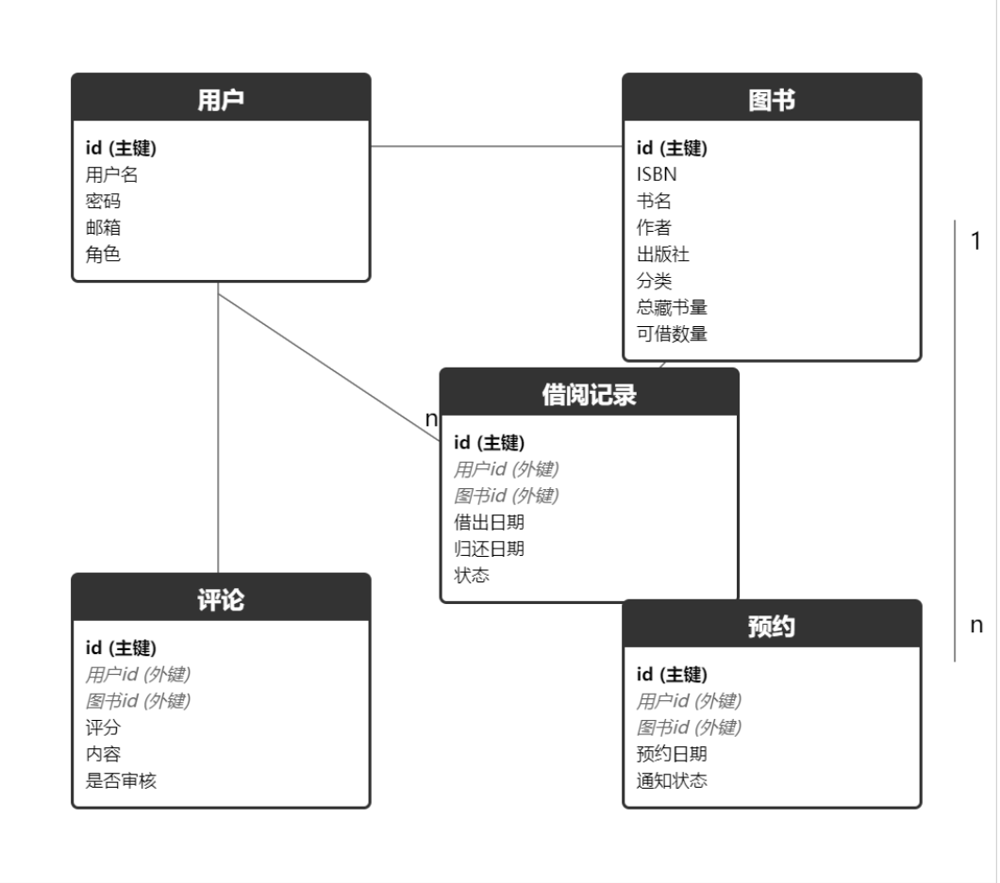
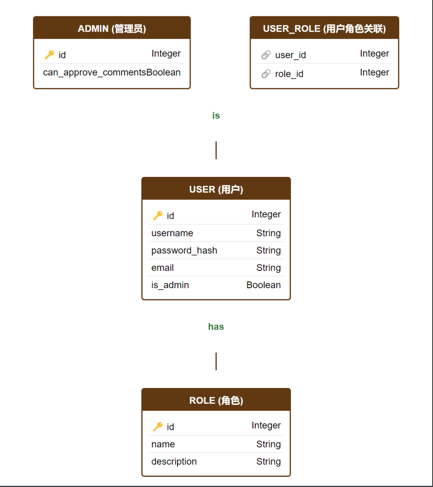

# 图书管理系统实验报告

**姓名**：[陈铭毅]
**学号**：[2022412550]
**课程**：[人工智能实训]

---

## 一、实验目的

本实验旨在设计并实现一个基于Flask框架的功能完整的图书管理系统。通过该系统，用户能够进行图书的增、删、改、查操作，管理借书与还书流程，同时支持用户的注册与登录功能。实验的过程中，将深入理解Web应用开发的流程、数据库设计的重要性、事务处理的必要性以及用户权限控制的实现方式。

---

## 二、实验环境

1. **操作系统**：Windows 10
2. **编程语言**：Python 3.7+
3. **主要依赖**：
   - Flask 2.0.1
   - SQLAlchemy 1.4.23
   - Flask-Login 0.5.0
   - Bootstrap 5
4. **数据库**：SQLite（更换为MySQL可扩展至更大应用场景）

---

## 三、系统设计与实现

### 1. 技术选型

在设计系统时，综合考虑了开发效率、社区支持及项目需求，最终选择以下技术栈：

- **后端框架**：FlaskFlask是一款轻量级的Web框架，具有高度可扩展性，适合中小型项目开发。其简洁的设计理念和丰富的插件生态使其成为本项目的理想选择。
- **数据库**：SQLiteSQLite是一个轻量级的关系型数据库，易于集成，无需额外安装服务器，适合开发和小型应用场景。未来可根据需要切换至MySQL以支持更大规模的数据和并发访问。
- **前端框架**：Bootstrap 5Bootstrap提供了丰富的UI组件和响应式设计能力，能够快速构建美观且用户友好的界面。
- **ORM**：SQLAlchemy
  SQLAlchemy简化了数据库操作，通过对象关系映射（ORM）使得数据库交互更加直观和高效。

### 2. 数据库设计

根据系统功能需求，设计了以下数据库表：

- **users表**：存储用户信息，包括用户名、密码、邮箱、角色等。
- **books表**：存储图书信息，如书名、作者、出版日期、ISBN号、类别、库存量等。
- **loans表**：记录借阅信息，包括用户ID、图书ID、借阅日期、归还日期、状态等。
- **comments表**：存储用户对图书的评论和评分。
- **reservations表**：记录图书的预约信息。

**ER图示意：**





### 3. 功能实现


#### 3.1 用户管理功能

**用户注册与登录**
用户可以通过注册界面创建新账户，系统验证用户名唯一性、邮箱格式及密码强度。登录时，用户需输入有效的用户名和密码，系统通过Flask-Login进行身份验证。


**用户角色与权限管理**
系统支持管理员与普通用户角色。管理员拥有管理图书信息、审核用户评论、配置系统参数等高权限操作；普通用户则可以借还图书、查看图书信息及发表评论。


**用户信息修改**
用户登录后，可以在个人主页修改个人信息，如密码和联系邮箱。

关键代码示例：

```python
from flask import Blueprint, render_template, redirect, url_for, flash, request
from flask_login import login_user, logout_user, login_required, current_user
from werkzeug.security import generate_password_hash, check_password_hash
from .models import User
from . import db

bp = Blueprint('auth', __name__)

@bp.route('/register', methods=['GET', 'POST'])
def register():
    if request.method == 'POST':
        # 获取表单数据并验证
        username = request.form['username']
        email = request.form['email']
        password = request.form['password']
        # 验证逻辑
        if User.query.filter_by(username=username).first():
            flash('用户名已存在')
            return redirect(url_for('auth.register'))
        if not validate_email(email):
            flash('无效的邮箱格式')
            return redirect(url_for('auth.register'))
        # 密码加密
        hashed_password = generate_password_hash(password)
        new_user = User(username=username, email=email, password=hashed_password, role='user')
        db.session.add(new_user)
        db.session.commit()
        flash('注册成功，请登录')
        return redirect(url_for('auth.login'))
    return render_template('register.html')

@bp.route('/login', methods=['GET', 'POST'])
def login():
    if request.method == 'POST':
        # 获取表单数据
        username = request.form['username']
        password = request.form['password']
        user = User.query.filter_by(username=username).first()
        if user and check_password_hash(user.password, password):
            login_user(user)
            flash('登录成功')
            return redirect(url_for('main.home'))
        flash('用户名或密码错误')
    return render_template('login.html')
```

#### 3.2 图书管理功能

**图书信息增加**
管理员可以通过后台界面添加新图书，系统对ISBN号进行唯一性验证，防止重复添加。


**图书信息查询与修改**
用户和管理员可以按书名、作者、ISBN等字段进行搜索。管理员可以修改图书的基本信息，如库存量、类别等，系统自动计算可用库存。


**图书信息删除**
管理员在删除图书前，系统会检查是否存在未归还的借阅记录，确保数据一致性后方可删除。


关键代码示例：

```python
@bp.route('/book/<int:id>/edit', methods=['GET', 'POST'])
@login_required
def book_edit(id):
    if not current_user.is_admin:
        flash('权限不足')
        return redirect(url_for('book.book_list'))
  
    book = Book.query.get_or_404(id)
  
    if request.method == 'POST':
        book.isbn = request.form['isbn']
        book.title = request.form['title']
        book.author = request.form['author']
        book.publisher = request.form['publisher']
        book.category = request.form['category']
        new_total = int(request.form['total_copies'])
    
        # 计算新的可用库存
        borrowed = book.total_copies - book.available_copies
        book.total_copies = new_total
        book.available_copies = max(0, new_total - borrowed)
    
        db.session.commit()
        flash('图书信息已更新')
        return redirect(url_for('book.book_detail', id=book.id))
  
    return render_template('edit_book.html', book=book)
```

#### 3.3 借书与还书管理功能

**借书功能**
用户可以借阅图书，系统检测库存及用户的借书数量限制。借书时记录借阅日期及归还日期，若图书库存不足，提示用户。


**还书功能**
用户归还图书后，系统更新库存及借阅状态。系统检查用户的借阅记录，确保其确有该图书未归还。


**逾期检查**
系统定期检查借阅记录，标记逾期未还的图书，提高用户体验和图书管理效率。

关键代码示例：

```python
@bp.route('/borrow/<int:book_id>', methods=['POST'])
@login_required
def borrow_book(book_id):
    book = Book.query.get_or_404(book_id)
    if book.available_copies <= 0:
        flash('库存不足，无法借阅')
        return redirect(url_for('book.book_detail', id=book_id))
  
    user_loans = Loan.query.filter_by(user_id=current_user.id, status='borrowed').count()
    if user_loans >= MAX_BORROW_LIMIT:
        flash('已达到最大借阅数量')
        return redirect(url_for('book.book_detail', id=book_id))
  
    loan = Loan(user_id=current_user.id, book_id=book_id, borrow_date=datetime.utcnow(),
                return_date=datetime.utcnow() + timedelta(days=30), status='borrowed')
    book.available_copies -= 1
    db.session.add(loan)
    db.session.commit()
    flash('借阅成功')
    return redirect(url_for('book.book_detail', id=book_id))

@bp.route('/return/<int:loan_id>', methods=['POST'])
@login_required
def return_book(loan_id):
    loan = Loan.query.get_or_404(loan_id)
    if loan.user_id != current_user.id or loan.status != 'borrowed':
        flash('还书操作无效')
        return redirect(url_for('main.home'))
  
    loan.status = 'returned'
    loan.returned_date = datetime.utcnow()
    loan.book.available_copies += 1
    db.session.commit()
    flash('还书成功')
    return redirect(url_for('main.home'))
```

#### 3.4 系统扩展性（选做功能）

**图形用户界面（GUI）设计**
使用Bootstrap 5构建响应式且美观的用户界面，提供良好的用户体验。


**书评和评分**
用户可以对借阅过的书籍进行评分和评论，管理员审核通过后公开展示。


**图书推荐系统**
基于用户的借阅历史或评分，系统推荐相关书籍，提升用户粘性。


**借书历史查询**
用户可查看个人的借书历史，管理员可以查看所有用户的借书记录，便于统计与管理。


**预约功能**
当图书借出时，用户可以预约，图书归还后系统自动通知预约用户（待实现邮件通知功能）。

关键代码示例（评论功能）：

```python
@bp.route('/book/<int:book_id>/comment', methods=['POST'])
@login_required
def add_comment(book_id):
    book = Book.query.get_or_404(book_id)
    rating = int(request.form.get('rating', 0))
    content = request.form.get('content', '').strip()
  
    # 检查用户是否已经评论过这本书
    existing_comment = Comment.query.filter_by(user_id=current_user.id, book_id=book_id).first()
    if existing_comment:
        flash('您已经评论过这本书了')
        return redirect(url_for('book.book_detail', id=book_id))
  
    if rating < 1 or rating > 5:
        flash('评分范围为1到5星')
        return redirect(url_for('book.book_detail', id=book_id))
  
    comment = Comment(user_id=current_user.id, book_id=book_id, rating=rating, content=content, approved=current_user.is_admin)
    db.session.add(comment)
    db.session.commit()
    flash('评论提交成功，等待管理员审核')
    return redirect(url_for('book.book_detail', id=book_id))
```

---

## 四、遇到的问题及解决方案

### 1. 库存管理问题

**问题**：在修改图书总库存时，需要考虑已借出的数量，避免出现可用库存负数或数据不一致。

**解决方案**：使用公式 `available_copies = new_total - borrowed` 计算新的可用库存量，其中 `borrowed` 为已借出的数量。同时，在修改库存时使用数据库事务，确保数据操作的原子性和一致性。

### 2. 删除图书的安全性

**问题**：直接删除图书可能导致存在未归还的借阅记录，从而造成数据不一致。

**解决方案**：在删除图书前，系统首先检查是否存在状态为“borrowed”的借阅记录。如果存在，则禁止删除并提示管理员有未归还的图书。确保图书删除前数据的一致性和完整性。

### 3. 评论系统的用户体验

**问题**：用户可能对同一本书重复评论，影响评论质量和系统数据的准确性。

**解决方案**：在用户提交评论前，系统检查该用户是否已对该书进行过评论。如果已存在评论，系统提示用户无法重复评论，保证每个用户对每本书仅有一条有效评论。

### 4. 前端页面布局混乱

**问题**：初期前端页面设计较为混乱，缺乏统一的布局和风格，影响用户体验和开发效率。

**解决方案**：采用模板继承机制，将公共部分（如导航栏、页脚等）抽取至 `base.html`，其他页面模板继承自 `base.html`，统一风格和布局。同时，优化CSS和JavaScript的组织结构，提高页面的可维护性和美观性。

---

## 五、主要功能实现

### 1. 图书编辑功能实现

**功能说明**：

- 实现了管理员编辑图书信息的功能。
- 自动计算新的可用库存数量，确保库存数据准确。
- 添加了权限验证，确保只有管理员能操作。
- 使用事务确保数据一致性，防止中途操作失败导致数据混乱。

**关键代码**：

```python
@bp.route('/book/<int:id>/edit', methods=['GET', 'POST'])
@login_required
def book_edit(id):
    if not current_user.is_admin:
        flash('权限不足')
        return redirect(url_for('book.book_list'))
    
    book = Book.query.get_or_404(id)
  
    if request.method == 'POST':
        book.isbn = request.form['isbn']
        book.title = request.form['title']
        book.author = request.form['author']
        book.publisher = request.form['publisher']
        book.category = request.form['category']
        new_total = int(request.form['total_copies'])
    
        # 计算新的可用库存
        borrowed = book.total_copies - book.available_copies
        book.total_copies = new_total
        book.available_copies = max(0, new_total - borrowed)
    
        db.session.commit()
        flash('图书信息已更新')
        return redirect(url_for('book.book_detail', id=book.id))
  
    return render_template('edit_book.html', book=book)
```

### 2. 图书删除功能实现

**功能说明**：

- 实现了管理员删除图书的功能。
- 删除前检查是否有未归还的借阅记录，保证数据一致性。
- 使用事务保证删除过程的安全性。
- 添加了用户提示信息，明确操作结果。

**关键代码**：

```python
@bp.route('/book/<int:id>/delete', methods=['POST'])
@login_required
def book_delete(id):
    if not current_user.is_admin:
        flash('权限不足')
        return redirect(url_for('book.book_list'))
    
    book = Book.query.get_or_404(id)
  
    # 检查是否有未归还的借阅
    active_loans = Loan.query.filter_by(book_id=id, status='borrowed').count()
  
    if active_loans > 0:
        flash('该图书还有未归还的借阅记录，无法删除')
        return redirect(url_for('book.book_detail', id=id))
  
    db.session.delete(book)
    db.session.commit()
    flash('图书已删除')
    return redirect(url_for('book.book_list'))
```

### 3. 评论功能实现

**功能说明**：

- 实现了用户对图书的评论和评分功能。
- 防止用户对同一本书重复评论，确保评论数据的唯一性。
- 管理员审核通过后，评论才会公开展示，维持评论内容的质量。
- 支持1-5星评分系统，增强用户体验。

**关键代码**：

```python
@bp.route('/book/<int:book_id>/comment', methods=['POST'])
@login_required
def add_comment(book_id):
    book = Book.query.get_or_404(book_id)
    rating = int(request.form.get('rating', 0))
    content = request.form.get('content', '').strip()
  
    # 检查用户是否已经评论过这本书
    existing_comment = Comment.query.filter_by(user_id=current_user.id, book_id=book_id).first()
  
    if existing_comment:
        flash('您已经评论过这本书了')
        return redirect(url_for('book.book_detail', id=book_id))
  
    if rating < 1 or rating > 5:
        flash('评分范围为1到5星')
        return redirect(url_for('book.book_detail', id=book_id))
  
    comment = Comment(user_id=current_user.id, book_id=book_id, rating=rating, content=content, approved=current_user.is_admin)
    db.session.add(comment)
    db.session.commit()
    flash('评论提交成功，等待管理员审核')
    return redirect(url_for('book.book_detail', id=book_id))
```

---

## 六、遇到的问题及解决方案

### 1. 数据库设计的完善性

**问题**：初期数据库设计不够完善，随着功能的增加需要频繁修改表结构，导致开发过程繁琐且容易出错。

**解决方案**：在项目初期进行详细的需求分析，完善数据库设计，预估可能的扩展需求。使用迁移工具（如Flask-Migrate）管理数据库版本，简化表结构的修改和数据库的更新过程。

### 2. 图书删除导致的数据不一致

**问题**：在未检查借阅记录的情况下删除图书，导致存在未归还的借阅记录与图书数据不一致。

**解决方案**：在删除图书前，增加对未归还借阅记录的检查逻辑，确保只有在图书无被借阅的情况下才能删除。同时，利用数据库事务处理，保持数据操作的原子性。

### 3. 前端页面布局混乱

**问题**：初期前端页面设计缺乏统一的布局模板，导致各页面样式不一致，开发效率低下。

**解决方案**：采用模板继承机制，将公共部分抽取至 `base.html`，其他页面模板继承自 `base.html`，统一导航栏、页脚等元素。优化CSS和JavaScript文件的组织，提升页面的一致性与可维护性。

### 4. 用户评论的重复性

**问题**：用户可能对同一本书进行重复评论，影响评论系统的准确性和用户体验。

**解决方案**：在用户提交评论前，系统检查该用户是否已对该书进行过评论。如果存在重复评论，提示用户无法重复提交。确保每个用户对每本书只有一条有效评论记录。

### 5. 数据一致性维护

**问题**：在多步数据操作过程中，如借书与更新库存，若中途发生错误，可能导致数据不一致。

**解决方案**：使用数据库事务，确保多步数据操作的原子性。若任一步骤失败，整体事务回滚，保持数据库数据的一致性和完整性。

---

## 七、心得体会

通过本次实验，我深入理解了Web应用开发的全流程，从需求分析、技术选型、数据库设计到具体功能的实现与调试。特别是在以下几个方面有了显著的提升：

1. **数据库设计的重要性**一个合理且完善的数据库设计能够极大地简化后续的开发工作，减少频繁修改表结构的麻烦。前期的详细需求分析和数据库设计是项目成功的基石。
2. **事务处理的必要性**在涉及多步数据操作时，事务处理能够确保数据的一致性和完整性，避免因中途错误导致的数据混乱。这在实际项目中尤为重要。
3. **用户权限控制的实现方式**通过Flask-Login的集成，轻松实现了用户的登录与权限控制。区分管理员与普通用户的角色权限，使系统功能更加完善和安全。
4. **前后端交互的处理方法**
   使用Flask与Bootstrap结合，实现了前后端的良好协作。模板继承机制的应用，使前端页面结构更加清晰，便于维护和扩展。

尽管在开发过程中遇到了一些挑战，如数据库设计的调整、前端页面布局的优化等，但通过查阅资料、与同学讨论和不断调试，最终成功实现了预期的功能。这个项目不仅提升了我的编程技能，还增强了我解决问题的能力和团队协作意识。

---

## 八、改进方向

尽管系统已实现基本功能，但仍有许多方面可以进一步优化和扩展：

1. **图书封面上传功能**为每本图书增加封面图片上传功能，提升用户体验和界面美观度。
2. **邮件通知系统**实现借书、还书、预约成功等操作的邮件通知功能，提升用户体验和系统的智能化水平。
3. **借阅统计与报表**增加更详细的借阅统计功能，如热门图书排行、用户借阅习惯分析等，辅助管理员进行数据决策。
4. **前端界面优化**进一步优化前端界面设计，提升用户体验，增加响应式设计适配更多设备。
5. **安全增强**加强系统的安全性，如防止SQL注入、XSS攻击，使用更强的密码加密算法等，确保用户数据的安全。
6. **移动端支持**开发专门的移动端应用或优化现有Web界面的移动端适配，以满足更多用户的需求。
7. **图书推荐算法优化**
   引入更复杂的推荐算法，如基于协同过滤或内容推荐，提高图书推荐的准确性和个性化程度。

---

## 九、参考资料

1. **Flask官方文档**[https://flask.palletsprojects.com/](https://flask.palletsprojects.com/)
2. **SQLAlchemy文档**[https://docs.sqlalchemy.org/](https://docs.sqlalchemy.org/)
3. **Flask-Login文档**[https://flask-login.readthedocs.io/](https://flask-login.readthedocs.io/)
4. **Bootstrap 5文档**[https://getbootstrap.com/docs/5.0/getting-started/introduction/](https://getbootstrap.com/docs/5.0/getting-started/introduction/)
5. **《Flask Web开发实战》**作者：[作者姓名]出版社：[出版社名称]ISBN：[ISBN号]
6. **相关网络资源**

   - GitHub开源项目示例
   - Stack Overflow社区讨论
   - 博客文章及教程视频
